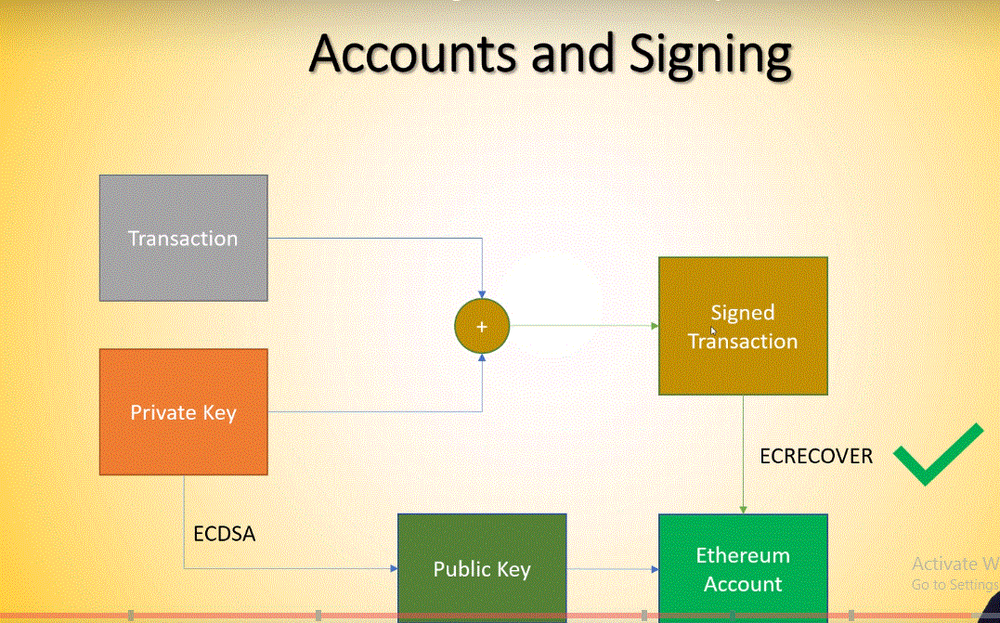

# Section 3: Transactions, Wallets and Hashing

Start with MetaMask

## Transactions Key Points

+ You need a Blockchain node to interact with the Blockchain
+ The Blockchain is the single source of truth in the whole system
+ There are infrastructure providers to abstract running Blockchains away.

## Signatures Key Points

  

+ Transaction signatures ensure authenticity of transactions.
+ Signatures are generated from Private keys.
+ Public keys and Addresses are generated from Private keys.
+ Private keys must be kept confidential under all circumstances.
+ __Pk__ : Public Key; __Sk__ : Secret Key
  + __Signature Function__ : SignatureFunc(Hash(info), Sk) = Signature
  + __Validation Function__ : ValidationFunc(Hash(info),Signature, Pk) = True/False