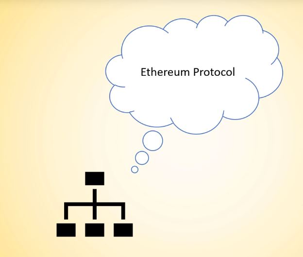
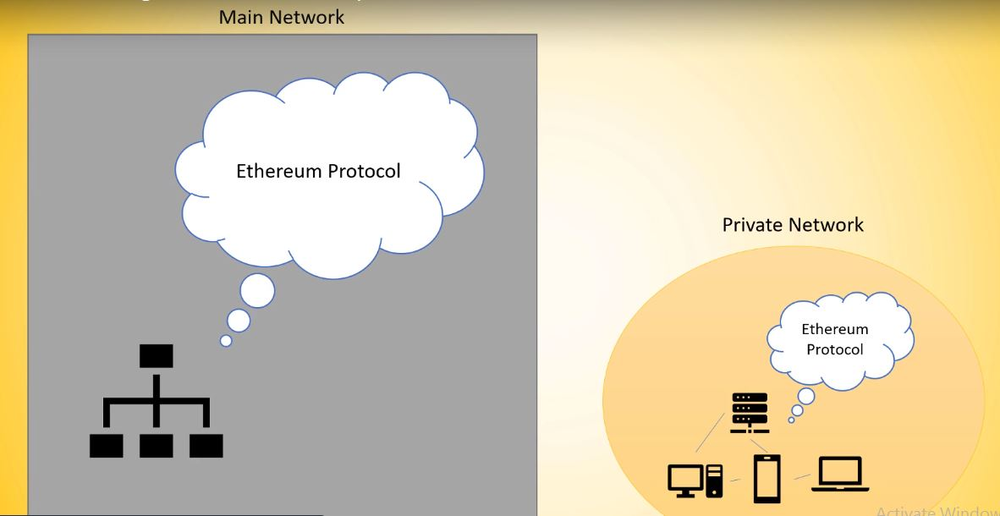
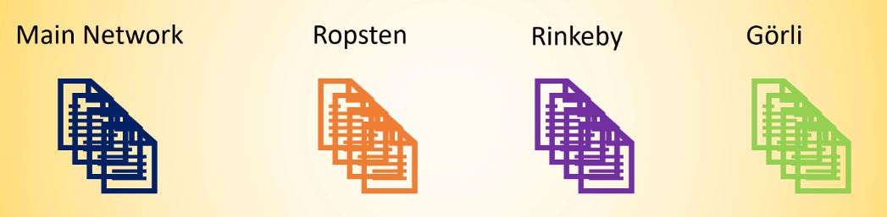
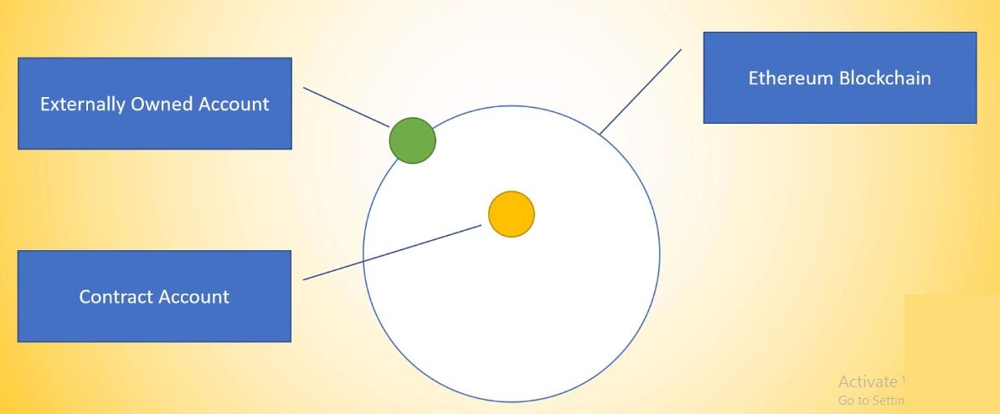
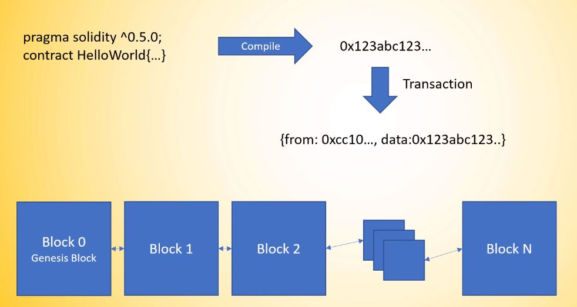
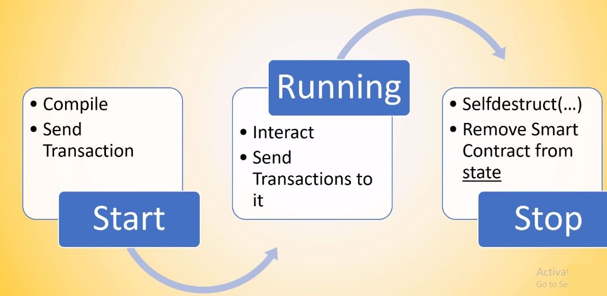

# Section 4: Solidity

__Lab__: Remix

## Smart Contracts

+ Word was coined by a computer scientist Nick Szabo in 1994.
+ A smart contract can be defined as an _"automatic transaction handling algorithm"_
+ It is a piece of code running on the blockchain:
  + It is a state maching
  + Needs transactions to change state
  + Can do logical operations
+ Statechange happens through mining+transaction
+ It is Turing complete: _In theory_ it can solve any computation problem.
+ Commong Smart Contract programming languages: __Solidity__ (Most common; Derived from ECMAscript), __Vyper__ (Research oriented; Derived from Python), __LLL__ (Like Low-level Lisp), __Serpent__ (Similar to Python), __Mutan__ (Deprecated GO based language) . Post compilation, these are sent as __EVM Bytecode__ to the blockchain. The _data_ field in the transaction details contains the compiled code.
+ When you deploy the smart contract to the blockchain, every ethereum node in the network executes the same code because every node has a copy of the chain.

## Structure of a Solidity Contract

+ Start with the __pragma__ line. This is a pre-compiler statement. Locks in the solidity compiler version.
+ "__Class__" like structure.
+ Contains functions
+ Control structures: if/else
+ Loops: For/While
+ DataTypes: (U)Int, Boolean, Array, Struct, Mapping, Address. __No Floats__.
+ Inheritable
+ Special structures like "modifiers"
+ Imports

## Environments in Remix

+ __JavaScript VM__ : Creates an in memory blockchain node in the browser and deploys the contracts in it.
+ __Injected Web3__ : Creates a node in the test networks like MetaMask
+ __Web3 Provider__ : Allows you to connect to an external Blockchain Node prvider. One of the common one is [Ganache](<https://www.trufflesuite.com/ganache>).

## Ethereum Nodes and Networks

+ The nodes in the network are able to talk with each other because they are talking with the __Ethereum Protocol__.
+ There are different implementations of the same protocol in different languages: __GoEthereum__, __Parity__, __HyperLedger__.
+ It is not necessary to have one single Eth network. You can use ethereum inside a private network as well.

+ And the two networks would not contain the same data especially if they are started from scratch. (i.e.) if you send any transaction in the private network, then it is registered only in the private network and it is not in the main network.
+ Another way of creating a private network is to fork the main network at some point in time. In this case, the data present in the main network upto that point in time would also be in the private network and then we can continue with the private network from there on.
+ Either way, the private network will start with the first block called the __Genesys block__ - it is the first block on the network and it comes from the genesys file which contains the configuration for the genesys block.

+ The main network is the longest existing network and where ether costs money and the protocol seldom changes.
+ The other networks are very similar to the main network but they are here for testing things like consensus protocols, protocol changes and give smart contract developers the ability to test their contracts. But they all still require _mining_.
+ Thus developers implemented their own blockchain simulation - __Ganache__.

| Main Network | Test Network | Ganache |
| --- | --- | --- |
| Persistent | Persistent, but can be deleted | Non-Persistent |
| Real blockchain | Real blockchain | Unit testing |
| Costs money | Beta release | Fast|

## Variables

> __Transaction Vs. Call__ : A transaction is necessary, if a value in a Smart Contract needs to be updated (writing to state). A call is done, if a value is read. Transactions cost Ether (gas), need to be mined and therefore take a while until the value is reflected. Calls are virtually free and instant.

__All Variables__ :

+ All variables are initialized by default. There is no "null" or "undefined".
+ A _public variable_ automatically creates a _getter function_ with the name of the variable. You can not create a function with the same name as the variable by yourself.
+ Reference types (eg. strings) need a memory location (memory/storage).

__(Unsigned) Integers__ :

+ _Keyword_ : `uint`
+ Integers are numbers without decimals and _unsigned_ integers are capable of representing only __non-negative__ integers.
+ The default value for an integer is 0.
+ `uint8` to `uint256` in 8 bit increments (i.e.) `uint8`, `uint16`, `uint24`...
+ __Unsigned__ : `uint8` ranges from 0 to 255 (since 28 = 256). Similarly `uint256` had 2256 values. `uint` is an alias for `uint256`.
+ __Signed__ :`int8` ranges from -128 to 127
+ __Integer Wrap Around__ (Prior to version 0.8.x) :
  + Prior Solidity 0.8.x, an integer would automatically roll-over to a higher or lower number (i.e.) decrementing an _unsigned integer_ of value 0 would not result in error or -1 but would give the value: `MAX(uint)`
  + This can become problematic, if you store a token-balance in a variable and decrement it without checking.
+ __Integer Wrap Around__ (Post version 0.8.x) :
  + In 0.8, the compiler will automatically take care of overflow and underflow and will throw an error when we try to increment or decrement past the limit.
  + But you can willfully roll over by wrapping the increment/decrement code inside the `unchecked` block.

__Booleans__ :

+ _Keyword_ : `bool`
+ The default value set to a bool variable is _false_.
+ Boolean types have the standard operators: ! (logical negation), && (logical conjunction, "and"), || (logical disjunction, "or"), == (equality), != (inequality).

__Addresses and Balances__ :

+ _Keyword_ : `address`
+ To store the address of an account.
+ Ethereum supports transfer of Ether and communication between Smart Contracts. Those reside on an _address_. Addresses can be stored in Smart Contracts in the address variable and can be used to transfer Ether from the Smart Contract to the address.
+ In general, the address variable holds __20 bytes__ of data.
+ One main parameter of the address type is `balance`. `address.balance` returns the balance of the account in Wei.

> __1 Ether = 1018Wei__. Ethereum Denominations: <https://ethdocs.org/en/latest/ether.html>

__Strings and Bytes__ :

+ _Keyword_ : `string`
+ By default strings will be empty.
+ It is not very easy to work with strings in Solidity because internally they are stored as _byte arrays_ and converted to UTF-8 and shown. Solidity is not really made for working with strings (larger strings especially) and it is quite expensive in terms of gas. Thus as a rule of thumb try to avoid strings and use __Events__ instead.
+ Natively there are no string manipulation functions (no string comparison, no find-replace etc.). But there are libraries to work with strings.
+ There are other ways to work with strings like storing them externally and using its hash to check if the string is valid etc.
+ String is equal to bytes, but does not have a length or index access.
+ Bytes for arbitrary length raw data.
+ Strings for arbitrary length string (UTF-8) data.

__Fixed Point Numbers (Not implemented yet)__ :

+ _Keyword_ : `ufixedMxN` or `fixedMxN`
+ `ufixed128x18` gives 128 bits with 18 decimal points.

> Not all rules of modern development apply to blockchain development (eg.) the limited resources available and the variable initialization.

## Important Concepts

+ The Smart Contract is stored under its own address
+ The Smart Contract can store an address in a variable, which can be its own address, but can be any other address as well.
+ All information on the blochain is public, so we can retrieve the balance of the address stored in a variable.
+ The Smart Contract can transfer funds from his own address to another address. _But it cannot transfer the funds from another address_.
+ Transferring Ether is fundamentally different than transferring ERC20 Tokens.

## Understanding Accounts and Transferring Ether

> A transaction is an Atomic operation.

> Refer __SendMoney.sol__

__Externally Owned Accounts (EOA)__ :

+ They have a private key behind them.
+ These are the accounts that we use to send funds, initiate transactions etc.
+ They are kind of outside the Ethereum chain.
+ Only an externally owned account can initiate a transaction.

__Contract Account__ :

+ They do not have a private key. These accounts contain code, which manage the account.
+ They are present on the blockchain.
+ Smart contracts or Contract accounts cannot trigger a transaction on their own. Once the transaction is initialized by an EOA, the contract account can contact other contract accounts to do something there. But a contract account can never initialize a transaction.

__Addresses__ :

+ In blockchain, the amount owned be each address is stored on the __ledger__ on the blockchain and it is publicly available. It is not stored on your wallet or address or anywhere. Your wallet stores a _private key_. This private key generates a _public key_ which in turn generates an _address_ and the blockchain is a __database__ that contains how much is owned by each address.
+ The address has two important members:
  + `.balance` : gives the balance of the address in Wei.
  + `.transfer(amountInWei)` : transfers the amount in Wei from the smart contract to the address.
+ The address also has some low-level calls.
  + `.send()` : Existed before `.transfer()`. The `.send()` returns a Boolean (`false` if the transaction fails) and does not cascade any exceptions (unlike `.transfer()`).
  + `.callvalue()`
  + Beware of possible re-entrancy bugs
+ `.send()` and `.transfer()` both only transfer 2300 gas along.

__Global Objects__ :

+ Global objects help to understand where transactions come from and what happens inside.
+ Three very important parameters:
  + `msg.sender` : Address of the account that initializes the transaction.
  + `msg.value` : The amount in Wei that was sent in the transaction.
  + `now` : The current timestamp. Beware, this can be influenced to a certain degree (15 secs) by miners. So do not use it for odd/even numbers or random number generation etc.

__Payable__ :

+ A function _cannot_ receive ether unless it is marked as `payable` (eg.) `address payable myAddress`, `function myFunction() public payable {...}`
+ If a function is not marked as payable but receives Ether, then it fails.

## Start, Stop, Pause and Delete Smart Contracts

> Refer __StartStopUpdateExample.sol__

+ The `constructor() {...}` function automatically gets called only once when the Contract is deployed.
+ The `require(condition, "Error")` function is used to validate the requirement conditions.  If the `condition` evaluates to false it will stop the transaction, roll-back any changes made so far and emit the error message as String.
+ A Smart Contract cannot be "paused" on a protocol-level on the Ethereum Blockchain. But we can add some logic "in code" to pause it.
+ The `selfdestruct(toAddress)` function destroys the Smart Contract. It can be called only once and takes one address as an argument to which all the remaining balance of the Smart Contract will be sent before self-destructing.
  + __Be careful with the Contract lifecycle__. Post destroying the contract, you will still be able to send money to it because you are just executing a transaction to an address. So there is nothing wrong with it. You will also be able to call the function to withdraw the amount from the Smart Contract, (The transaction will be marked as success). But you will __not__ receive the Ether into your address. This is because, you sent one ether to the address of the SC, but there is no more code running at that address now that could send you the funds back. _Your Ether is locked!_

> With the [CREATE2](https://eips.ethereum.org/EIPS/eip-1014) op-code you can instruct the EVM to place your Smart Contract on a specific address. Then you could call `selfdestruct()`, thus remove the source code. Then re-deploy a different Smart Contract to the same address.

__Deployment__ :

+ After writing the Smart Contract, you compile it to the __EVM bytecode__ and this bytecode is baked into a transaction in the _data_ field of the transaction.
+ The transaction is then sent to the network and once it is mined, it is added to a block N and is distributed across all the nodes in the network.
+ The next blocks are added over the block N.

> __Data Immutability__ :This is why it is impossible to delete data once it is on the blockchain. If you want to delete data, you have to remap all the blocks created post the block you want to delete and you have to replicate this change across all the nodes which is not possible.

__Smart Contract Lifecycle__ :

+ __Deploy__ :
  + `sendTransaction({from:...;to:empty;data:'0x23786923874'})`. 
  + When the Smart Contract is deployed, in the transaction, the bytecode is filled into the `data` field. The `to` field will be empty. So when a transaction comes in with `data` filled and the `to` field empty, then the mining knows that it is a Contract and adds it to a block and gives it its own address.
+ __Interact__ :
  + Every interaction with a Smart Contract is transaction based.
  + `sendTransaction({to:smartContractAddress;data:'0x237869238';value:10000000000000})`
  + The `data` field is filled with a specific encoded function call and arguments.
+ __Destroy/Stop__ :
  + Call `selfdestruct(beneficiaryAddress)` inside a solidity function.
  + The Smart Contract will not be available on any of the blocks afterwards anymore.
