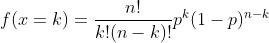
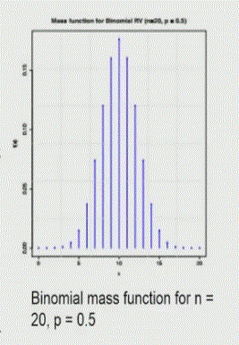
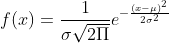
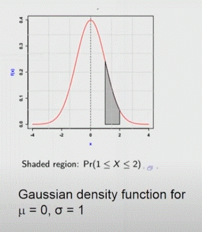
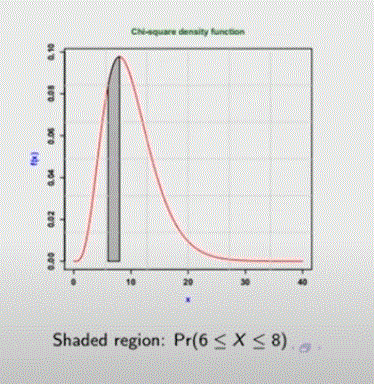

# __Data Science for Engineers__

## __Week 3 - Statistics__

### __3.1 Statistical Modelling__

__Random Phenomena and Probability__:

+ Phenomena can be classified as the follows:
  + __Deterministic phenomena__ - whose outcome can be predicted with a very high degree of confidence.
  + __Stochastic phenomena__ - which can have many possible outcomes for the same experimental conditions. Outcome can be predicted with limited confidence.
+ We are interested in stochastic phenomena because all the data we obtain from experiments contain __errors__. The sources of these errors can be:
  + Lack of knowledge of generation process __(model error)__
  + Errors in sensors used for observing outcomes __(measurement error)__
+ Types of random phenomena:
  + __Discrete__ - Outcomes are finite
  + __Continuous__ - Infinite number of outcomes

__Sample Space__ (Discrete phenomena) :

+ Set of all possible outcomes of a random experiment.
  + Coin toss: S = {H, T}
  + Two coin tosses: S = {HH, HT, TH, TT}

__Events__ (Discrete phenomena) :

+ Subset of the sample space.
  + Occurrence of a head in the first toss of a two coin toss experiment A = {HH, HT}
+ Outcomes of a sample space are elementary events.

__Probability measure__ :

+ Associated with each of the events is a probability.
+ The probability that __Events A and B both occur__ is the probability of the intersection of A and B. It is denoted by __P(A ∩ B__). Generally, __P(A ∩ B) = P(A) P(B|A)__. This is called the __Rule of Multiplication__. If Events A and B are _mutually exclusive_, P(A ∩ B) = 0.
+ The probability that __Events A or B occur__ is the probability of the union of A and B. It is denoted by __P(A ∪ B)__. Generally, __P(A ∪ B) = P(A) + P(B) - P(A ∩ B)__. This is called the __Rule of Addition__.
+ Probability measure is a function that assigns a real value to every outcome of a random phenomena which satisfies the following axioms:
  + __0 =< P(A) =< 1__ (i.e.) Probabilities are non-negative and < 1 for any event A
  + __P(S) = 1__ (i.e.) one of the outcomes should occur
  + For two mutually exclusive events A and B: __P(A U B) = P(A) + P(B)__
+ Interpretaion of probability as a frequency:
  + Conduct an experiment (coin toss) N times. If NA is the number of times outcome A occurs, then __P(A) = NA/N__

__Independent events__ :

+ Two events are said to be independent, if occurence of one has no influence on the occurence of the other.
  + Formally, we consider A and B to be __independent__ if and only if __P(A ∩ B) = P(A) x P(B)__ (i.e.) _the joint occurence of A and B_ can be obtained by multiplying their respective probabilities.
  + For example, in a two coin toss experiment, the occurrence of head in the second toss can be assumed to be independent of head or tail in the first toss, then P(HH) = P(H in first toss) x P(H in second toss) = 0.5 x 0.5 = 0.25

__Mutually exclusive events__ :

+ Two events are mutually exclusive if the occurrence of one implies the other event does not occur.
  + In a coin toss experiment, events {HH} and {HT} are mutually exclusive. If we know that 2 heads have occurred, then it is clear that the event {HT} did not occur. Therefore, P(HH and HT) = __P(HH) + P(HT)__ = 0.25 + 0.25 = 0.5

__Other rules of probability__ :

+ Some of the important probability rules can be probed using Venn diagrams.
+ Ac is the complement of event A. So, __P(Ac)__ = P(S) - P(A) = __1 - P(A)__
+ If __B ⊆ A__, then P(B) < P(A).
+ Probability of A __or__ B: __P(A U B) = P(A) + P(B) - P(A ∩ B)__

__Conditional Probability__ :

+ If two events A and B are not independent, then information available about the outcome of event A can influence the prediction of event B.
+ The conditional probability is denoted as __P(B|A)__ (i.e.) _the probability of event B occurring given that event A has occurred_.
  + __P(B|A) = P(A ∩ B)/P(A)__, if P(A) > 0
  + From the above rule, we can derive the __Bayes rule__: __P(A|B)P(B) = P(B|A)P(A)__
  + __P(A) = P(A|B)P(B) + P(A|Bc)P(Bc)__

___

### __3.2 Random Variables, PMF and PDF__

__Random Variable__ :

+ A RV is a function which maps the outcomes of a sample space to a real line. So, there is a unique real number that is associated to every outcome in the sample space.
+ Why do we need a RV? Consider the coin toss example. The Sample space is: {H, T}. Unfortunately, we will not be able to do numerical computations with such a representation. Therefore we map these outcomes to two points on a real line: H -> 0 and T -> 1. A Random Variable or function maps the outcomes to a real line. If the outcomes of a random phenomena are already numbers (like in the case of rolling a dice), then we don't need this mapping and can work with the outcomes themselves.
+ __Discrete RV__ (throw of a dice or coin); __Continuous RV__ (sensor readings, time interval between failures)

__Probability Mass/Density Functions__ :

+ A probability mass or a density function is a measure that maps the outcomes of a RV to values between 0 and 1.
+ For a _discrete RV_, the __PMF__ assigns a probability to every outcome in a sample space.
  + Sample space of RV(x) for a coin toss: [0, 1]
  + P(x = 0) = 0.5; P(x = 1) = 0.5
+ For a _continuous RV_, the __PDF__ _f(x)_ can be used to compute the probability for every outcome of the RV within an interval.
  + In the case of a continuous RV, there will be infinity of outcomes, and therefore we can associate a probability with every outcome. However, we can associate a probability that the random variable lies within some _finite interval_.
  + Consider a RV x which can take any value in the real line from [-∞, ∞], then we define the __density function f(x)__ such that the probability that the RV lies in an interval [a, b] is defined as __P(a < x < b) = ∫abf(x) dx__. _Integral => Area_ Thus, the area under the curve f(x) in the limits a and b gives the probability.
  + Also, area under the entire curve = 1 (i.e.) ∫-∞∞f(x) dx = 1
+ __Cumulative Density Function__: denoted by F() and  is the probability that the random variable x lies in the interval -∞ to b for every value of b. __F(b) = P(-∞ < x < b) = ∫-∞bf(x) dx__. If b = -∞, then CDF = 0 and if b = ∞, then CDF = 1. Thus, as b: -∞ -->: ∞, the CDF: 0 --> 1

__Binomial Mass Function__ :

+ Wikipedia: _The binomial distribution with parameters n and p is the discrete probability distribution of the number of successes in a sequence of n independent experiments, each asking a yes–no question, and each with its own Boolean-valued outcome: success (with probability p) or failure (with probability q = 1 − p)._
+ Consider a coin toss experiment. What is the probability of obtaining _k_ heads in _n_ coin tosses with _p_ as the probability of obtaining a head in any toss.
+ So, the RV x represents the number of heads obtained out of the n tosses. Therefore, sample space is: [0, 1,...,n]. Each of the outcomes of the sample space has some probability associated with it which is given by:

+ The equation is a PMF characterized by a single parameter _p_.

+ For large _n_ it tends to be a _Gaussian distribution_ - bell shaped curve. For computational purposes, for large values of n we use the Gaussian distribution instead of the Binomial distribution.

The Binomial Mass Function was a PMF of a Discrete RV. The following is for a Continuous RV.

__Gaussian or Normal Density Function__ :

+ Used to characterize random errors in data. The density function is given as follows:

+ This is a PDF characterized by 2 parameters: _μ_ - the mean and _σ_ - the standard deviation. σ2 is called the __variance__. Typically σ2 tells how wide the distribution will be (i.e.) how far the values are spread around the central value μ and μ tells the value at which the density function attains the highest probability.
+ It is a bell shaped curve.

+ The curve is symmetric.
+ A particular case of μ = 0 and σ = 1 is called __Standard Normal Distribution__.

__Chi-square Density Function__ :

+ Density is characterized by a parameter _n_ - Degrees of freedom.

+ As seen from the graph, the RV that follows the chi-squared distributions can have values only between 0 and ∞. The probability to have -ve values is exactly 0.
+ This distribution arises when you _square a standard normal variable_. So, the square of a standard normal variable will be a chi-square distribution with one degree of freedom. If you take n independent standard normal variables and square and add all of them that will result in a chi-square distribution with n degrees of freedom.
+ Distribution of a Sample Variance follows a chi-square distribution.

The following are some of the properties of these density functions.

__Moments of a PDF__ :

+ Similar to describing a function using derivatives, a PDF can be described by its moments. These moments are denoted by the symbol E[(some function)]. _E - expectation_.
  + For Continuous distributions: __E[xk] = ∫-∞∞xkf(x) dx__. Here, f(x) is the density function. This is called the Moments of the distribution. If k = 1, then its called the first moment and so on.
  + For discrete distributions: __E[xk] = Σi=1N xi p(xi)__. Here, p(xi) - the probability of obtaining the outcome xi
  + __Mean__(the first moment): __μ = E[x]__
  + __Variance__: σ2 = E[(x - μ)2] = __E[x2] - μ2__. Here, E[x2] is the second moment.
  + Standard deviation = Square root of variance.

__Properties of Gaussian RVs__ :

+ For a Gaussian RV x:
  + __Mean: E[x] = μ__. μ is the first parameter of the distribution.
  + __Variance: E[(x - μ)2] = σ2__ which is the second parameter of the distribution.
  + Symbolically, we can define the Normal Distribution RV x as: __x ~ N(μ, σ2)__. Here, N -> Normal distribution, μ, σ2 -> parameters of the distribution. Thus it represents the entire density function.
  + Thus for a Standard Gaussian RV __z ~ N(0,1)__
+ If x is a normally distributed RV with μ and σ2, then if we take a linear function of this x denoted by _y = ax + b_; where a and b are some constants. Then we can show that y will also have a normal distribution as follows: __y ~ N(aμ+b, a2σ2)__.
+ This linear transformation can be used to do __Standardization__ where we define: If x ~ N(μ, σ2), then we can define a new RV: __z = (x - μ)/σ__ ~ N(0,1). Here, z is a linear transformation or a linear function of x. Therefore, we can apply the previous rule and show that z is a standard normal distributed variable which means it has a mean = 0 and a standard deviation or variance = 1. This process is also known as standardization.

__Computation of probability in R__ :

+ Given a value x and asked "What is the probability that this continuous random variable lies between the interval -∞ and X ?". Then we have to calculate P(-∞ < x < X) = ∫-∞Xf(x) dx.
+ The function in R for doing this is `pnorm(X, mean, std, 'lower.tail'=TRUE/FALSE)`
  + _norm_ refers to the distribution and can be replaced by other distributions (chisq, exp, unif)
  + _X_ is the limit value
  + _mean_ and _std_ - the parameters of the distribution. In the normal distribution. There are two parameters, but other distributions such as chi-squared may have one parameter, such as the degrees of freedom and exponential distribution will have one parameter such as the lambda and so on.
  + _lower.tail=TRUE_ (default) to obtain the lower tail probability (i.e.) -∞ to X and _FALSE_ to obtain the upper tail probability (i.e.) X to ∞.

__Other functions in R__ :

+ Function to compute X given the probability p:
  + `qnorm(p, mean, std, 'lower.tail'=TRUE/FALSE)`. When _lower.tail=TRUE_, it will compute X such that ∫-∞Xf(x) dx = p
  + `dnorm()` to compute density function value.
  + `rnorm()` to generate random numbers from the distribution.

We have seen the distribution of single RV till now.

__Joint PDF of two RV__ :

+ Joint pdf of two continuous RVs x and y: f(x,y) is given by: __P(x <=a, y <=b) = ∫-∞b∫-∞a f(x, y) dx dy__. This gives the __volume__ of the function f(x, y).
+ In addition to the variance of x and y, we can also compute the __covariance__ of x and y: __σxy = E[(x - μx)(y - μy)]__
+ The correlation between x and y is the standardized form of covariance: __ρxy = σxy/σxσy__. ρxy varies between -1 and +1 depending on the extent of correlation between x and y
+ Two RVs x and y are uncorrelated if σxy = 0
+ Two RVs x and y are independent if f(x,y) = f(x)f(y) (i.e.) the joint density function of f(x,y) can be written as the product of the individual density functions or marginal density functions of x and y.

__Multivariate Normal Distribution__ :

+ From 2 variables to n variables.
+ A vector of RVs: x = [x1 x2 ...... xn]T
+ Multivariate Gaussian Distribution: __x ~ N(μ, Σ)__
  + E[x] = μ : Mean vector
  + E[(x-μ)(x-μ)T] = Σ : Variance-covariance matrix

+ We can see that the covariance matrix is a square matrix with diagonal elements representing the _variance_ of each of the elements of RV vector x and the off-diagonal elements representing the _pair-wise covariance_.
+ We can completely characterize the multivariate normal distribution by specifying this mean vector μ and the covariance matrix Σ.

___

### __3.3 Sample Statistics__

__Need for Sampling__ :

+ What is the need for performing statistical analysis when we have already talked about PDFs and so on?
+ Typically, when we are actually doing analysis we do not know the entire sample space. We may also not know all the parameters of the distribution from which the samples are being withdrawn. Typically we actually obtain only a few samples of the total number of available population . So, from this finite sample we have to derive conclusions about the probability density function of the entire population and also infer about the parameters of these distributions. So, the sample or observation set is supposed to be sufficiently representative of the entire sample space.

__Basic Concepts__ :

+ __Population__ : Set of all possible outcomes of a random experiment characterized by f(x)
+ __Sample set (realization)__ : Finite set of observations obtained through an experiment
+ __Inference__ : Conclusion derived regarding the population (pdf, parameters) from the sample set.
  + It is important to note that the inferences made from a sample set is also uncertain since it depends on the sample set which is one of the many possible realizations. Thus we need to provide the confidence intervals associated with these inferences as well.

__Statistical Analysis__ :

+ __Descriptive Statistics (Analysis)__ :
  + __Graphical__ : Organizing and presenting the data (eg. box plots, probability plots)
  + __Numerical__ : Summarizing the sample set (eg. mean, mode, range, variance, moment)
+ __Inferential Statistics__ :
  + __Estimation__ : Estimate parameters of the pdf along with its confidence region.
  + __Hypothesis testing__ : Making judgements about f(x) and its parameters.

Some of the summary statistics that we can define for a sample are as follows:

__Measures of Central Tendency__ :

+ They are kind of the centre point of the entire sample.
+ The following represent the sample set by a single value
+ __Mean (or average) x̄__: (Sum of all data points)/(Number of data points)
  + Best estimate in _least square criterion_
  + The x̄ represents the unbiased estimation of the population mean μ: __E[x̄] = μ__
  + Affected by outliers
+ __Median__ : Value of xi such that 50% of the values are less than xi and 50% of the values are greater than xi.
  + Robust with respect to outliers.
  + Best estimate in _least absolute deviation_ sense.
+ __Mode__ : Value that occurs the most often (Most probable value)
  + If it is a continuous distribution; this represents the maximum value of the density function. And you should expect most of the data to be clustered around this most probable value.
  + Sometimes the distribution may have two modes - _bimodal distribution_ - in which case if you sample from such a distribution, you will find two clusters, one around each mode

__Measures of Spread__ :

+ Represents the spread of the sample set (i.e.) how widely the data is ranging.
+ __Sample Variance__ : s2 = (1/N-1) Σi=1N (xi - x̄)2
  + Unbiased estimate of population variance: __E[s2] = σ2__
  + Standard deviation = sqrt(Variance)
  + Affected by outliers
  + _Typically we divide by (N - 1) to indicate that if you have only one data point; it is not possible to estimate s2. For example, if you have one one data point s2 will turn out to be 0 because the mean will be equal to the point. So, really speaking you have only (N - 1) data points to estimate the spread. So, that is why we divide by (N - 1) to indicate that one data point has been used up to estimate the parameter_
+ __Mean absolute deviation__ = (1/N) Σi=1N |xi - x̄|
  + Robust with respect to outliers.
  + Here also we can divide by (N - 1) instead of N using the same explanation provided above.
+ __Range__ : R = xmax - xmin
+ All of these give an indication of how much the data is spread around the central measure which is the mean or the mode or the median.

Giving just a couple of these numbers will allow you to figure out some of the characteristics of the sample and that is the power of _sample statistics_.

__Distribution of Sample mean and Sample variance__ :

+ __Sample mean__ :
  + For any distribution, sample mean is unbiased estimate of population mean.
  + If xi ~ N(μ, σ2) and all the observations are mutually independent, then __x̄ ~ N(μ, σ2/N)__.
  + _Explanation_ : Let us say you draw  N observations from the distribution xi ~ N(μ, σ2) and these draws are independent and does not have any bias. If you compute the sample average from this set of independent samples, then you can prove that x̄ is also _normally distributed_ with the same population mean μ; which means the expected value of x̄ is μ and the expected variance of x̄, however, is σ2/N. So, the the variance of x̄ is actually lower than the variance of the individual observations. _The important point here to be noted is if I have N repeats from the same distribution and if I take the average of them, the average will be less noisy than the original observations_. So, one simple way of dealing with noise and reducing the noise content in observations is to take n observations at the same experimental condition and average them.
+ __Sample Variance__ :
  + For any distribution, sample variance is unbiased estimate of population variance.
  + If xi ~ N(μ, σ2) and all the observations are mutually independent, then __(N - 1)S2 / σ2 ~ χ2N-1__ (i.e.) if we take (N - 1) times the _sample variance_ divided by the _population variance_; we can show that this particular measure is a chi-squared distribution with (N - 1) degrees of freedom.

__Graphical Analysis__ :

+ __Histograms__ :
  + Divide the range of values in the sample set into small intervals and count how many observations fall into each interval.
  + For each interval, plot a rectangle with __width__ = inerval size and __height__ = number of observations in the interval called as the _frequency_.

+ __Box Plots__ :
  + Find _quartiles_ (Q1 - 25th percentile, Q2 - median and Q3 - 75th percentile), minimum and maximum values in range.
  + Box is between the Q1 and Q3 and the whiskers are between the min and max.

+ __Probability Plot__ (p-p or q-q plot) :
  + Useful to know about the distribution of data.
  + Determine different quantile values from sample set. Plot computed quantiles vs theoretical quantile values from chosen distribution.
  + Here instead of determining just Q1, Q2, Q3 you compute several quantiles and then plot these quantiles against the distribution which you think this data might follow. If the data falls on the 45 degree line, then you can conclude that the sample data has been drawn from the appropriate distribution you are testing it against.
  + So, this is useful for visually figuring out the distribution from which the data comes

+ __Scatter Plot__ :
  + Plot one RV (y) against another RV (x) to examine whether there is any dependency.
  + If the random variable y has a dependency on x, then the data will be aligned in a linear fashion. On the other hand, if there is no dependency the data will be randomly spread with no clear pattern

___

### __3.4 Hypothesis Testing__

Hypothesis testing is an important activity when you want to make decisions from a set of data.

The hypothesis is generally converted into a test for the mean or variance parameter of a population or perhaps a difference in themeans of two populations or the difference of variances of the population.

A hypothesis is a statement or postulate about the parameter of a distribution (or model).

+ __Null Hypothesis H0__ : The default or status quo postulate that we wish to reject if the sample set provides sufficient evidence. In inferential statistics, the null hypothesis is a default hypothesis that a quantity to be measured is zero. (eg.) There is no change in the pressure of the engine hub and it is same as the original.
+ __Alternative Hypothesis H1__ : The alternative postulate that is accepted if the null hypothesis is rejected. (eg.) The pressure is increased.

All Hypothesis tests will have Null and Alternate Hypothesis.

__Hypothesis Testing Procedure__ :

+ Identify the parameter of interest (mean, variance, proportion) which you wish to test.
+ Construct the Null and Alternate hypotheses.
+ Compute a test statistic which is a function of the sample set of observations. The test statistic is a function of the observations. For example, if you are testing for the population mean you may use the sample mean as the test statistic. If you are testing for the population variance you may use the sample variance as test statistic and so on.
+ Derive the distribution of test statistic under the null hypothesis assumption (i.e.) if the Null Hypothesis is true, then what is the distribution of the test statistic.
+ Based on the above distribution, choose a test criterion (threshold) against which the test statistic is compared to reject/not reject the null hypothesis.

No hypothesis test is perfect. There are inherent errors since it is based on observations that are random. The performance of the Hypothesis test depends on:

+ Extent of variability in data
+ Number of observations (Sample size)
+ Test Statistic (function of observations)
+ Test criterion (threshold)

We don't have much control over the extent of variability in data. But we can control the sample size and the threshold to improve the performance of the test.

__Types of Hypothesis test__ :

+ __Two-sided test__ : There are 2 thresholds - a lower criterion one and an upper threshold - which we select from an appropriate distribution. (eg.) H0 : μ = 0, H1 : μ != 0
+ __One-sided test__ : There is only one threshold - either upper or lower. (eg.) H0 : μ = 0, H1 : μ > 0

__Errors in Hypothesis Testing__ :

+ There are two types of errors - __Type I__ and __Type II__

+ Type I error - false alarm. The probability of Type I error is denoted by __α__ and is also called as the __level of significance of the test__. This is the error that we typically control. It is controlled by choosing the criterion from the distribution of the test statistic under Null Hypothesis. This is easy to do because we solidly know the Null Hyp and the distribution for it and that is not the case with H1.
+ The probability of Type II error is denoted by __β__. You do not control the type II error probability. When you construct this hypothesis test to compute the test statistic and choose a threshold you basically try to control the Type I error probability. The Type II error probability results as a consequence of this.
+ There is a __trade-off__ between the Type I and II errors (i.e.) if we decrease Type I the Type II will increase and accordingly the test will be less or more sensitive.
