# __Data Science for Engineers__

## __Week 4 - Optimization__

### __4.1 Optimaization for data science__

_Wikipedia: An optimization problem consists of maximizing or minimizing a real function by systematically choosing input values from within an allowed set and computing the value of the function_.

In optimiztion, we are basically interested in finding the "best" solution. By "best solution" we mean that we try to either _maximize_ or _minimize_ the function f(X). This can be done by doing somethin on the variables in our control - which is X in this case. These variables are called the __decision variables__.

But most of the time, we wont have complete control over these decision variables. We would have set of __constraints__ (_an allowed set_) on the values of the decision variables.

(_Go through the m < n, m > n cases in Linear Algebra where we followed the optimization approch to arrive at a solution_)

Determining the best solution to a problem can be done using specific methods:

+ Find the best functional representation of data (_linear regression types_)
  + When there is no constraint on what values these variables can take, it is called the __unconstrained optimization problem__. This is the type of problem that can be solved in __linear regression__ and in general this is also called as __function approximation problem__.
+ Find the best hyperplane to classify the data (_classification types_)
  + Hyperplanes are expressed as equations and the parameters that define these planes become the decision variables.
  + And in this case the function that we try to optimize is that when we choose a hyperplane _it should not miss classify any data_.

__Basic components of an optimization problem__:

+ __Objective function__ - _f_ - which we try to minimize or maximize. In general we talk about minimization problems because if we have a maximization problem with f it can be converted into a minimization problem with -f.
+ __Decision Variables__ - _X_ in _f(X)_
+ __Constraints__ - restricting _X_ to some set of values.

__Types of Optimization problems__ :

Depending on the type of objective functions, constraints and decision variables:

+ Linear programming problem
+ Nonlinear programming problem
  + Convexx Vs. Non-Convex
+ Integer programming problem (linear and nonlinear)
+ Mixed integer linear programming problem
+ Mixed integer nonlinear programming problem

__Nonlinear Optimization Unconstrained case__ :

+ __Univariate optimization__: There is only one decision variable for which we have to find the value. We typically write it as the following:

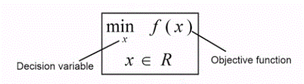

+ This means, we are going to minimize (_min_) the objective function _f(x)_ by controlling the decision variable _x_. _x_ is written beneath _'min'_. And _x ∈ R_ means: _x_ is continuous and could take any value on the real number line. And since this is a univariate optimization problem _x_ is a __scalar variable__ and not a vector variable.
+ Univariate problems can be easily visualzed in 2D. The decision variable x can be plotted on the x-axsis the resulting f(x) value on the y-axis as below:

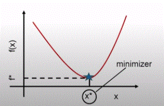

+ So, the value of x (__x\*__) for which the function attains its minimum value can be identified by dropping perpendicular to the x-axis and the value that the function takes at its minimum point (__f*__) can be identified by dropping this perpendicular onto the y axis and this f\* is the best value this function could possibly take.
+ Functions of this type are called __convex functions__ because there is only one minimum here. So, there is no question of multiple minima to choose from. So, in this case we call the point (x*, y*) as the __local minimum__ - because in the vicinity of this point this is the best solution that you can get - _and_ the __global minimum__ - the best solution across the entire region.
+ On the other hand, the following function is also an univariate optimization problem. But, there are two points where the function attains a minimum. At a local vicinity, x1\* is the minimum but when we move far away we get x2\* which is the minimum at its local vicinity but also minimum across the whole region. Thus, x1\* - _local minimum_ and x2\* - _local minimum and global minimum_.

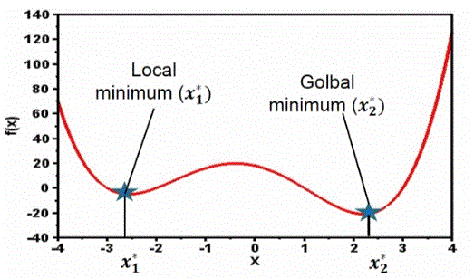

+ This is also called as the __non-convex function__ - where there are multiple local optima and the job of an optimizer is to find out the best solution from the many optimum solutions that are possible.

> It is not easy to solve the non-convex optimization problems. During the 90s there was a lot of research on Neural Networks and people tried to solve the optimization problems but it was very hard. In recent times, due to the availability of better algorithms, much better functional forms and much better training strategies, there is a possibility of attaining some notion of global optimality.

In convex functions, when you initialize from a particular point and try to find the best solution, you will arrive at x*. Since there is only one minima, no matter where you start from, you will arrive at the same point and thus your data science problem will __converge__ at the same solution even for multiple trials.

But in case of multiple optimality, when you initialize your functions from different points, you will get different optimal results. In other words, the algorithm will not give the same result consistently and more importantly, most of the time your algorithm will give you the result which is local minimum (i.e.) you could do much better (the global optimum), but you are not able to find the solution that that is much better. Thus several runs of the same datascience algorithm will get you several results and that is due to this _problem of initialization_.

__Univariate Optimization - Conditions for Local Optimum__ :

For an univariate optimization definded as: __minx f(x), x ∈ R__, the minimizer equation can be given by:

f(x) - f(x*) ≈ (1/2!) f"(x*)(x - x*)2

Necessary and sufficient conditions for x* to be minimizer of the function f(x) are:

+ First order necessary condition: f'(x) = 0
+ Second order sufficiency condition: f"(x*) > 0

_Thus to solve equations, take the first derivative f'(x) of the equation and equate it to 0 to solve for x. Subsitute the values of x in the second derivative of the equation f"(x*) and those giving the values greater than 0 would be the optimum values. If there are multiple values, then the global optimum can be found by substituting the optimum values in f(x) and identifying the one giving the lowest value._

---

### __4.2 Unconstrained Multivariate Optimization__

There are multiple decision variables. Therefore, a general function z could be defined as some non-linear function as follows

z = f(x1, x2,...,xn)

For example, in 2 decision variables the equation could be of form _z = sqrt(x12 + x22)_.

In univariate problems, we could express them in 2D plots with the single decision variable on the x-axis and the function output on the y-axis. But in multivariate problems, for the n decision variables would require a plot in _(n+1) dimensions_ (the +1th dimension is to describe the value of the function). Example, an equation with 2 decision variables can be plotted as follows:

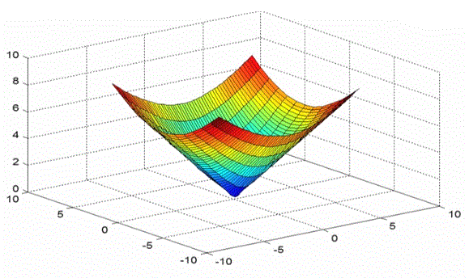

The 2 decision variables are along the 2 axes on the horizontal plane and the output is on the vertical axis. The minimum point on the image happens to be at (0,0) which is the solution.

In order to find the minimum point for this, we tend to draw __contour plots__. These can be visualized by passing 2D planes parallel to the x-axes in the image above and viewing from top. Note that, the objective funtion values across the plane would be a __constant__.

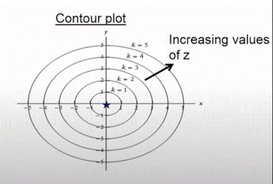

When we look at a particular contour on the outside, the value of the objective function (value of z) is big. Which means that this is not the optimal solution and taking any contour outside this would result in a bigger value for z. Thus, that is _not_ the direction in which we should we move in order to reduce the objective funciton. On the other hand, taking up the smaller contours gives us a reduced value for the objective function. This is how we determine the minimum solution.

When moving to a different contour, we will have to make 2 decisions:

+ The direction in which we have to move
+ Once the direction is decide, we need to know how far to move in that direction

These questions can be answered by a numerical methods of solving these kinds of unconstrained optimization problems (later on). Now we will see the analytical conditions for minimum in a multivariate problem.

Before that we will look at the local and global optima values for Multivariate scenario.

__Local and Global Optima__ :

Similar to the Univariate scenario, there could local and global opimum values for the multivariate optimization problems.

Consider a function with 2 decision variables.

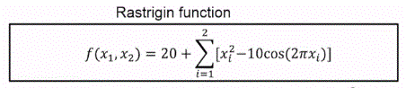

The plot for this is:

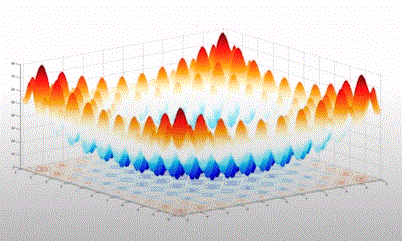

As we can evidently see from the image, there are multiple local and global optimas. The contour plot is as follows:

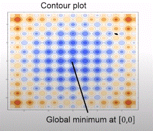

One of the local optimum is denoted by a black dot. Your optimization function could give the value of any of the local optima values. And in its vicinity that is the best solution to get. So, there is very little incentive to move away from this point because locally you are increasing your objective function value. So, ultimately your algorithm might find parameters which while may be acceptable, are not the best. So, this is one problem that needs to be solved really to have good efficient data cience algorithms.

Now, back to analytically solving the problem.

__Key Ideas__ :

Comparing with the _Univariate case_ where we had the following 2 conditions for identifying the minimum solution:

+ First order necessary condition: f'(x) = 0
+ Second order sufficiency condition: f"(x*) > 0

in the Multivariate case, the equivalent of __f'(x)__ is given by the __gradient__

In the Univariate case, as there was only one decision variable we took the derivative of it. But here it will be a _vector_, with each component being a _partial derivative_ with respect to each decision variable.

And the f"(x*) will be replaced by a __hessian matrix__ in the multivariate case. It is a nxn matrix.

(_Notice the denominators_)

+ Gradient of a function at a point is othogonal to the contours.
+ Gradient points in the direction of greatest increase of function.
+ Negative gradient points in the direction of the greatest decrease of the function.
+ Hessian is a __symmetric__ matrix.

__Conditions for local minima__ :

(_Much like what we did in the univariate case, we are going to do a Taylor series approximation_)

Finally, we arrive at:

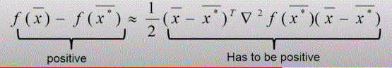

(i.e.) the new point x* has to be smaller than the current point x.

The term on the RHS is of the form: __𝛿TH𝛿__ where H -> Hessian Matrix. The output would be a scalar since: (1xn) (nxn) (nx1) = (1x1)

If the above equation is satisfied, then it would mean that x* is smaller than x and thus qualify it to be the minimum point.

__Summary of conditions__ :

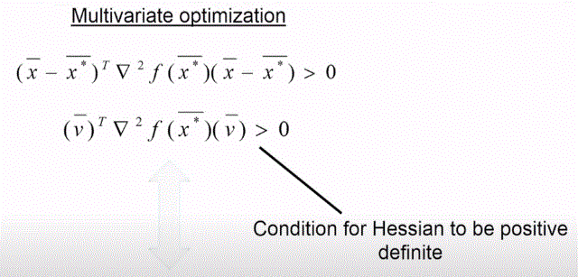

As seen before, the first condition is the equivalent of 𝛿TH𝛿 > 0, where H = ∇2f.

If we need this condition to be satisfied irrespective of the value of 𝛿, then we call H as the __positive definite matrix__. (i.e.) if H is a postivie definite matrix, then 𝛿TH𝛿 > 0 ∀ 𝛿 != 0

The second equation gives the condtion for the Hessian to be a positive definite. Hessian matrix is said to be positive definite at a point if all the eigen values of the Hessian matrix are positive. In other words if all the eigenvalues of this matrix are greater than 0, it is automatically guaranteed that whenever we compute 𝛿TH𝛿 for any delta direction we will always get a positive quantity.

So, in a multivariate case it gives us a way to identify points that could be optimum points, and once we identify those points we can compute this hessian matrix at those points and then computation of the eigenvalues of this hessian matrix would allow us to determine whether the point is a maximum point or a minimumpoint and so on.

In summary:

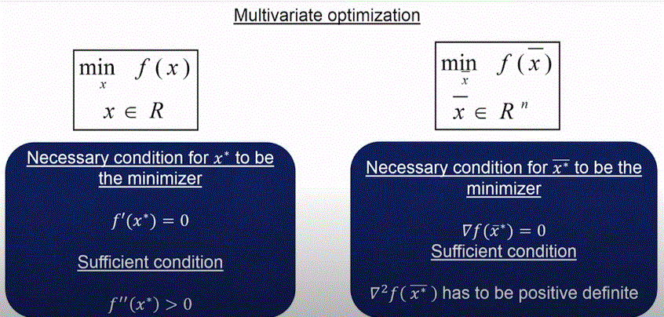

---

### __4.3 Unconstrained Multivariate Optimization (Continued)__

> _We are going to look at some numerical methods to solve the Multivariate problems. But why do we need to learn them? Because, any data science algorithm can be thought of as some form of an optimization algorithm and the following techniques will also be used in finding the solution for those data science problems/algorithms. Also, these numerical methods are called as the learning rule in ML._

__Directional Search__ :

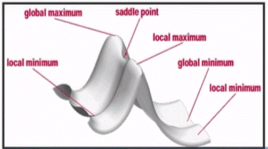

We can see that there are several different points on the surface: local minimum, global minimum, local maximum, global maximum, saddle point. Our aim is to avoid points like _local minima_ and _saddle point_ because we know that when we reach such regions, while locally we cannot make our algorithm to find anything better, globally it is not the best.

So, the aim is to reach the "bottom most region".

So, while standing at a particular point, you look around and find the direction in which you will do down the fastest. This _direction_ is called the __Steepest descent__.

So, the algorithm works in this way: From a point, find the steepest descent and then go in that direction for a _sensible amount of time_ or _length of step_. The reason for this is, you could find the steepest direction and keep going in that direction, but beyond a particular point, you do not really know if this is going to be the steepest descent. So, smarter strategy would be to find the steepest direction at wherever you are and then find how long you are going to move along this direction, go to the next point in the direction and then at that point reevaluate all the directions, and then find the new steepest descent direction. If it turns out that the direction that you are on is continuing to be the steepest descent direction, then you continue to go on that direction. If not, you find a new direction and then go in that new direction. This is the basic idea of all steepest descent algorithms.

Lets say you follow the steepest descent algorithm and reach the local minimum. Then at that point you will find no direction to improve your objective function (i.e.) you cannot minimize your objective function anymore. In which case, you are stuck in the local minimum.

There are optimization algorithms which try to get out of the local minimum. The only way to do it is to really climb up a little more away from the local minimum and then find new directions. And maybe you will find another direction which takes you to the global minimum. Thus in some cases we might construct these optimization algorithms in such a way that, you might actually make your objective function worse in the interim looking for better solutions than your local optimum solution.

__Descent direction and movement - Mathematics__ :

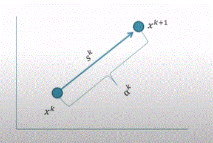

__xk+1 = xk + αksk__

where, xk -> current point of the kth iteration (the starting point); αk -> __Step length__; sk -> __Search direction__ and xk+1 -> is the new point which is better than xk generally.

Once we know the starting point and the direction, all we need to know is the step length. If αk is small then the xk+1th point will be closer to xk and vice versa.

In the equation, xk will be a (nx1) vector (where n -> number of decision variables), the search direction sk will also be a (nx1) vector and αk will be a scalar.

In case we have already figured out the direction (we will do that later), then all we need to know is the __step length__. Since the step length is a scalar, _the multivariate problem has now been broken down into a search direction computation and a univariate optimization of finding the step length (since it is a scalar)_.

+ In ML, this is called the __learning rule__ - because we are learning to go to a new point which is better than the current point.
+ In neural networks:
  + Back-propagation algorithm
  + Same gradient descent with application of chain rule
+ In clustering:
  + Minimization of an Euclidean distance norm

__Steepest descent and optimum step size__ :

> With all of these optimization algorithms, you would have to start with something called an __initialization__ which is x0, and this is true for machine learning algorithms also. All of them have to start at some point and depending on where you start, when you go through the sequence of steps in the algorithm, you will end up at some point x*, and in many cases if the problem is non-convex, (i.e.) there are multiple local minima and global minima, the point that you will end up is dependent on not only the algorithm, but also on the initialization point. That is the reason why in some cases if you run the same algorithm many times and if the choice of the initialization is randomized, every time you might get slightly different results. So, to interpret the difference in the results you have to really think about how the initialization is done.

Steepest descent:

+ An iteration k starting at point xk.
+ Then we need to find the search direction: sk = Negative gradient of f(x) = -∇f(xk)
+ Now, in the equation xk+1 = xk + αksk, we know xk and sk. So the only remaining thing is the step value αk which is given as f(xk+1) = f(xk + αksk) = f(α) [since we know everything except for α, it becomes a function of α] = is a minimum (univariate minimization)
+ Any univariate algorithm can be deployed to find the value of α.
+ Now that we know all the necessary values, we can substitute them in the equation starting with x0 and go on to find the the values of successive xk values till you reach the convergence.

> In ML, the α is known as the __learning rate__ and sometimes it is fixed or can be found by optimization.

---

