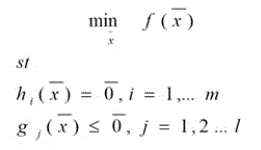
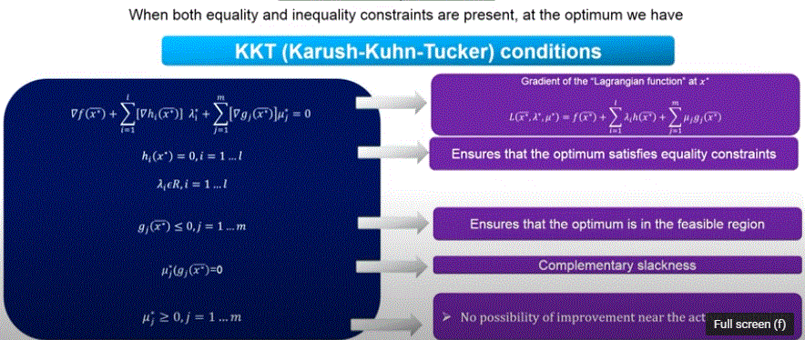
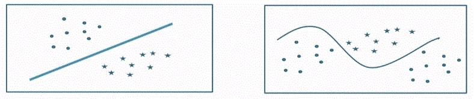
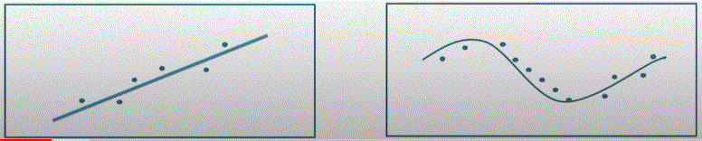
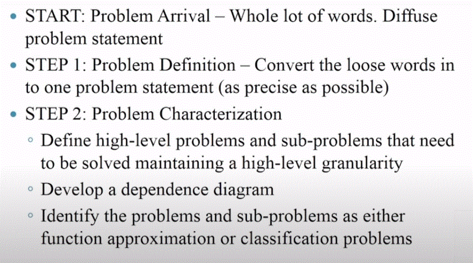
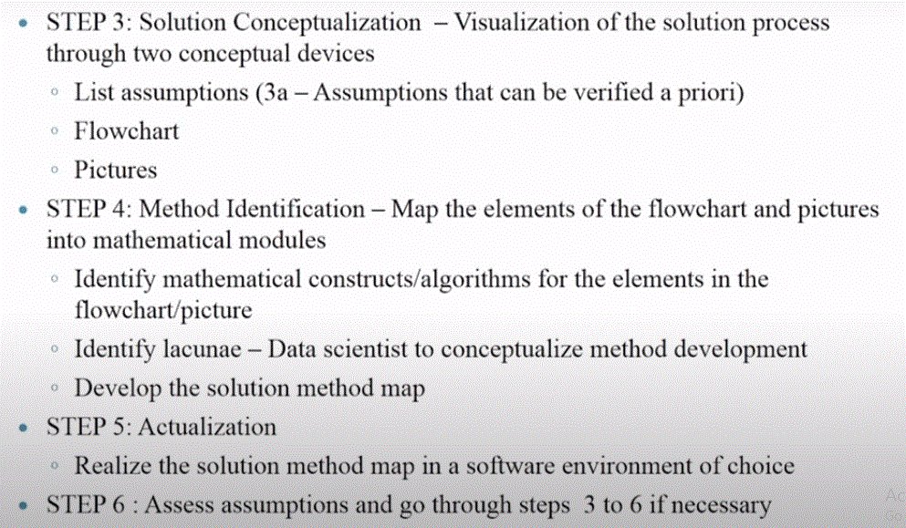
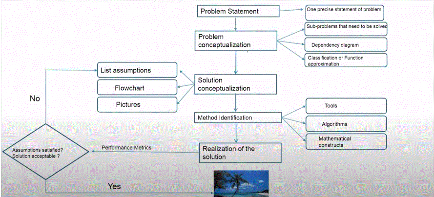

# __Data Science for Engineers__

## __Week 5 - Optimization (Contd.)__

### __4.1 Multivariate Optimaization with Equality Constraints__

> Unconstrained minimum is not the same as constrained minimum.

When you have an objective function that you need to minimze and is subject to a constraint, then the solution that you arrive should basically satisfy both the objective function and the constraint equation.

At optimum (one equality constraint case): __-∇f(x*) = λ*∇h(x*)__

_Here, when we find some solution so satisfy the equation and the constraint, then we would have the constraint equation as __h(x1,x2,....,xn) = 0__. Thus, we need to consider this as well as one of the equations to solve for the variables. Then we would have n+1 equations to find the n+1 variables (x1,x2,....,xn and λ)._

At higher dimensions and when there are more than one equality constraint: __-∇f(x\*) = Σli=1[∇hi(x*)]λi\*__ (i.e.) for 2 variables it would be -∇f(x\*) =  λ1\*∇h1(x\*) + λ2\*∇h2(x\*) and so on.

Gradient lies in the space spanned by the normal of the gradients.

---

### __4.2 Multivariate Optimaization with In-Equality Constraints__

> Why do we need inequality constraint problems? They primarily come into picture when we have to categorize the points on either side of the line. Any point > 0 will be on one side of the line and any point < 0  will be on the other side with the line being 0.

In the equality constraint, we had every point on the constraint line being the feasible solution and we chose the line that is closest to the optimum minimum.

But in the case of the inequality constraint, consider the line to divide the plane into two halfspaces. Now, depending on the constraint equation (lets say ax1 + bx2 =< c) it would represent one side of the line, (i.e.) either of the 2 halfspaces and the line itself. Importantly, if the unconstrained minimum also lies in this halfspace, then basically the unconstrained minimum and the constrained minimum are the same.

_Note that in the equality constraint, the unconstrained minimum and the constrained minimum were different. But in the inequality constraint, they will be the same in any one of the halfspaces._

Now for the other constraint, ax1 + bx2 >= c, this will represent the other halfspace. (If we assume that the previous constraint resulted in the unconstrained minimum and the constrained minimum being equal) then for this constraint the minimum would possibly be on the constraint line (same as equality constraint).

__General Formulation__ :

A general Multivariate Optimization problem would contain both equality and inequatlity constraints as follows:

> The equality constraints can always be represented in this way. Even if there is a constat on the RHS, it can be brought to the LHS leaving just 0 on the RHS. The inequality constraint as well can always be written as a <= condition. Even if there was a > condition, multiplying both the LHS and RHS with -1 would reverse the conditon.

+ Necessary conditions for x* to be the minimizer: __KKT condtions has to be satisfied__

+ Sufficient condition: __∇2L(x*) has to be a positive definite__

> In general it is difficult to use the KKT conditions to solve for optimum of an inequality constrained problem (than for a problem with equality constraints only) because we do not know in prior which constraints are active at the optimum (i.e.) in the complementary slackness condtion we don't know whether the mu is 0 or the g(x) is 0. This makes it an __combinatorial problem__. KKT conditions are generally used to verify that a point we have reached is a candidate optimal solution. Given a point, it is easy to check which constraints are binding.

_The μs have to be positive_.

---

### __4.3 Introduction to Data Science__

__Popular Techniques__ :

+ Regression Analysis
+ K-nearest-neighbor
+ K-means clustering
+ Logistic Regression
+ Principal Component Analysis'
+ Predictive analysis
  + Lasso, Elastic Net
+ Linear Discrminant Analysis (LDA)
+ Support Vector Machines
+ Decision Trees and Random Forests
+ Quadratic Discriminant Analysis
+ Naive Bayes Classifier
+ Hierarchical clustering

_With so many techniques available, what are the types of problems being solved? Why are there so many techniques?_

Fundamentally, there are 2 types of problems:

+ __Classification Problem__ : You have data that is _labelled_ - the data is categorized into different _classes_ . When you get new data, the data science algorithm should be able to assign the new data to either of the classes. (eg.) Binary classification problem
  + Problems where _linear equations_ can be a decision function for us to classify are called __linear classification problems__ (linear classifiable or linearly classifiable)
  + More complicated problems are the ones where a linear line or hyperplane will not be enough to make a classification. We would need a non-linear line. However, if your decision boundary or the function that you are going to use to classify is of the required non-linear form, then we could easily extend the concepts that we have learnt in terms of the half spaces and so on to do classification for these types of problems using __non-linear decision boundaries__.

+ __Function Approximation__ : It is the task of finding the functions that relate the input(s) to the output(s). And whenever we write a function, it will be parameterized. So the data science problem is: _given a set of outputs and their corresponding inputs, what is the functional form that relates them and what are the parameters in the function?_

_The above images are depicting Functional Approximation in 2D with one i/p and one o/p. However there could be many i/ps and one o/p or many i/ps and many o/ps._

__Thought Experiment__ :

+ Data analytical tools are like a microscope to probe higher dimensional data (i.e.) helps us to identify the hidden information.
+ Make assumptions that has the possibility of characterizing the higher dimensional data (eg.) Gaussian distribution, Linearly separable etc.

---

### __4.4 Data Imputation__

+ __Step 1__ : _Problem definition_ - Define the problem as broad as possible so that anyone can understand it.
+ __Step 2__ : _Problem Characterization_ - What type of problem is this?, What steps can be done to achieve a solution for the problem?
+ __Step 3__ : _Solution Conceptualization_ - Identify the requirements to achieve the solution. At this point, we also start making assumptions about the data. One basic assumption: All variables are independent of each other.
  + __Step 3a__ : _Verify Assumption_ - Some of the assumptions that we make can be verified right at this stage based on known statistical ideas and other ideas in terms of linear algebra and so on. If the assumption cannot be held, then we have to change the assumption. However, at times we might not be able to verify the assumptions that we make until we apply some of the ML techniques. When that happens, we have to come back and then change the assumptions.
+ __Step 4__ : _Method Identification_ - Coming up with a method that will answer our question as to what are the relationships among the variables.
  + Identify the relationships using null space.
+ __Step 5__ : _Actualization_ - Implement it in a programming language.
+ __Step 6__ : _Asses Assumptions_ - (Could use it in inteded applications to test the performance.) We try the developped algorithm on Test data.
+ Solution is realized (OR) reiterate from Step 3

__In Summary__ :

---
