# __Data Science for Engineers__

## __Week 6 - Regression__

### __6.1 Predictive Modelling__

__Preliminaries__:

+ n observations of x and y variables (xi,yi)
+ Sample means are given by:

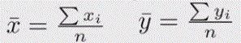

+ Sample Variances are given by (sometime n-1 is also used):

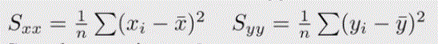

+ Sample Covariance is given by:

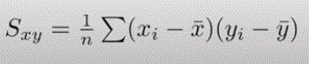

__Correlation__:

+ Indicates the strength of association between two variables.
+ Correlation DOES NOT imply Causation.
+ Scatter plots can give a visual representation of correlation. Scatter plots are a _qualitative_ metric of correlation.
+ We can _quantify_ correlation and there are several methods depending on the type of variable and the kind of association we are looking for.

__Pearson Correlation__ :

+ The Pearson's product-moment correlation coefficient is denoted by _rxy_. Sometimes the symbol 'ρ' is also used.
  

+ The numerator: covariance between x and y. The denominator: repeesents the standard deviation. This division by the denominator is what is called as _normalization_.
+ rxy takes a value between -1 (negative correlation) and +1 (positive correlation). rxy = 0 means no correlation.
+ The Pearson's correlation is a measure for the degree of linear dependence between x and y.
+ __Cannot be applied to ordinal (ranked) variables.__
+ _Sample size_ : Moderate (20 - 30) for good estimate.
+ _Robustness_ : Outliers can lead to misleading values.
+ _Note_ : There is __no__ gaurantee that if the Pearson Coeff is high then the relation is linear; we can only say that a relation is present. However, we can say that if the relation is linear, then the PC will be high (towards -1 or +1) and if the relation is non-linear then the PC may or maynot be high. And if PC =0, we can say that there is no linear relation but there could be some other relations present. Just looking at the PC we cannot make a strong conclusion.

__Spearman Rank Correlation__ :

+ Can be used for ordinal variables.
+ Gives the degree of association between 2 variables.
+ Linear or non-linear association.
+ The SR correlation will be high if x increases and y increases or decreases monotonically.
+ The SR correlation computation for n observations is given by the following where _di_ is the difference in the ranks given to the two variables values for each item in the data.

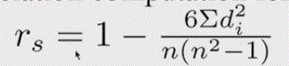

+ Example:

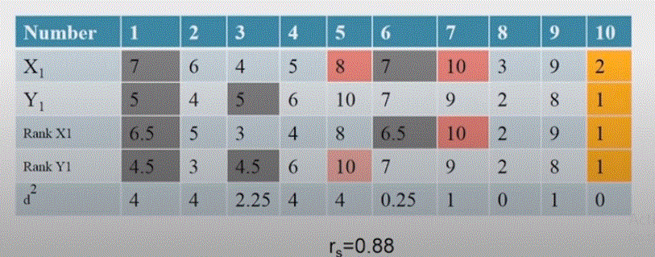

+ rs takes a value between -1 (negative correlation) and +1 (positive correlation). rs = 0 means no correlation.
+ rs = 1 : Monotonically increasing
+ rs = -1 : Monotonically decreasing

__Kendall Rank Correlation__ :

+ Correlation coefficient to measure the association between 2 ordinal variables.
+ _Concordant Pair_ : A pair of observations (x1,y1) and (x2,y2) that follows the property x1 > x2 and y1 > y2 or x1 < x2 and y1 < y2.
+ _Discordant Pair_ : A pair of observations (x1,y1) and (x2,y2) that follows the property x1 > x2 and y1 < y2 or x1 < x2 and y1 > y2.
+ We take every pair ofobservations in the sample and then assign whether there is a concordant or discordant pair
+ The Kendall Rank Correlation Coefficient is given by:

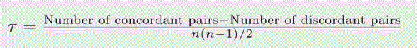

+ The pair for which x1=x2 and y1=y2 are ignored.
+ If the value is either near +1 or -1 then there is some relation.

---

### __6.2 Linear Regression__

__Regression__ :

+ Purpose is to build a functional relationship (model) between _dependent variable(s)_ and _independent variable(s)_.
+ One of the most widely used statistical techniques.
+ Dependent variables also known as _Response variable_, _Regressand_, _Predicted variable_, _output variable_ - denoted as variable/s _y_.
+ Independent variables also known as _Predictor variable_, _Regressor_, _Exploratory variable_, _input variable_ - denoted as variable/s _x_.

__Regression Types__ :

+ __Univariate__ vs __Multivariate__
  + _Univariate_ : One dependent and one independent variable
  + _Multivariate_ : Multiple dependent and multiple independent variables
+ __Linear__ vs __Nonlinear__
  + _Linear_ : Relationship is linear between dependent and independent variable
  + _Nonlinear_ : Relationship is nonlinear between dependent and independent variable
+ __Simple__ vs __Multiple__
  + _Simple_ : One dependent and one independent variable (SISO)
  + _Multiple_ : One dependent and multiple independent variable (MISO)

__Questions to be asked before Regression Analysis__ :

+ Is there a relationship between these variables?
+ Is the relationship linear and how strong is the relationship?
+ How accurately can we estimate the relationship?
+ How good is the model for prediction purposes?

__Regression Methods__ :

+ Linear Regression Methods
  + Simple Linear Regression
  + Multiple Linear Regression
  + Ridge Regression
  + Principal Component Regression
  + Lasso Regression
  + Prtial Least Squares Regression
+ Nonlinear Regression Methods
  + Polynomial Regression
  + Spline Regression
  + Neural Networks

__The Regression Process__ :

The regression process in itself is not a once through process. It is iterative.

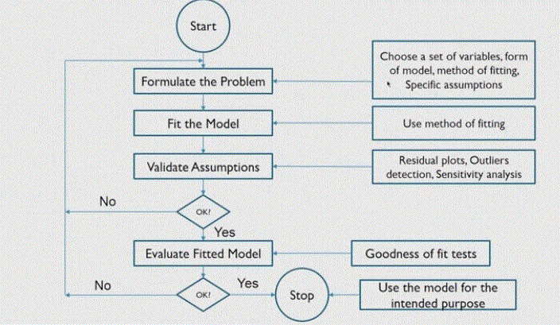

__Ordinary Least Squares__ :

+ Linear model between yi and xi, i = 1,...,n is given by:

    __yi = β0 + β1xi + ϵi__

+ In OLS we assume that the error is in only the dependent variable and there is no error in independent variable. Thus if you have 2 variables, then you choose the variable with the lease error as the independent variable. If on the other hand you believe both x and y contain significant error, then perhaps you should consider other methods called Total Least Squares or Principal Component Regression

    __ϵi = yi - β0 - β1xi__

+ The sum of squares of errors (SSE):

    __Σϵi2 = Σ(yi - β0 - β1xi)2__

+ The minimization of SSE by optimization gives β0 and β1. The hat symbol denotes that it is an estimate.

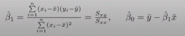

__Testing the Goodness of the Fit__ :

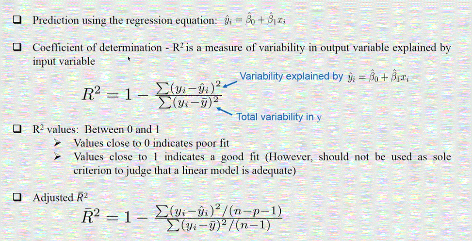

---

### __6.3 Model Assessment__

Whether the model that we have fitted is reasonbly good or not.

+ How good is the linear model?
+ What are the significant coefficients of the linear model (identify the important variables)?
+ Can we improve the quality of the linear model?
  + Are assumptions made about the errors reasonable?
  + Are there bad measurements in the data?

__Properties of Estimates__ :

+ Both the estimates of β0 and β1 are unbiased. (The estimates of a particular parameter are denoted by a hat `^` symbol)

  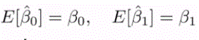

+ Variance of the estimates:

  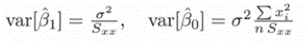

+ Estimate of σ:

  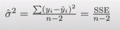

+ Distribution of slop estimate:

  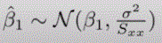

